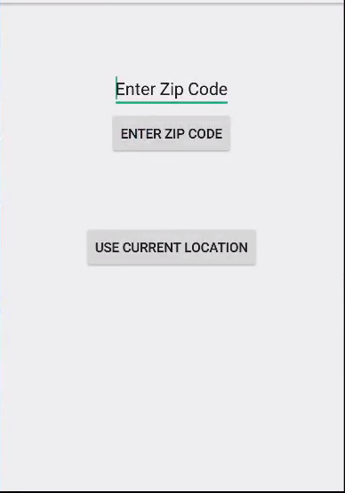
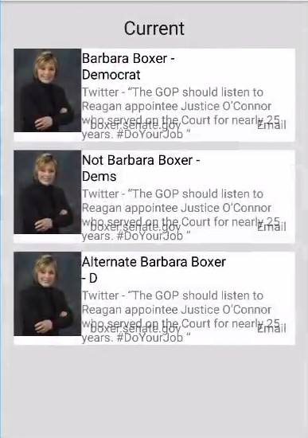
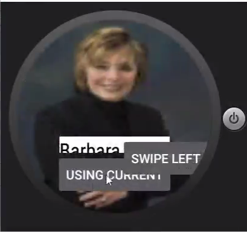
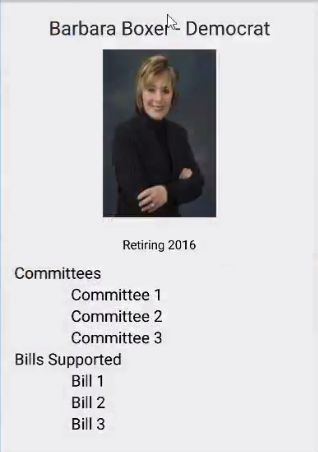
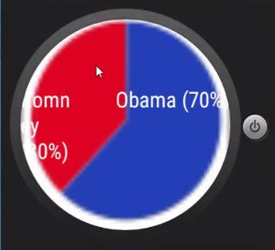

# PROG 02: Represent!

It is an app that is supposed to show you details about your congressional representatives.
Right now, it (extremely poorly) shows you Barbara Boxer and shuffles some strings around internally.

## Authors

Kevin Baum ([link.kb@berkeley.edu](mailto:link.kb@berkeley.edu))

## Demo Video

See [Represent] (https://www.youtube.com/watch?v=u08x4Z7hMWY)

## Screenshots

## Acknowledgments

* Hat tip to CS160 and Joleary for the Catnip base code
* Any other support
